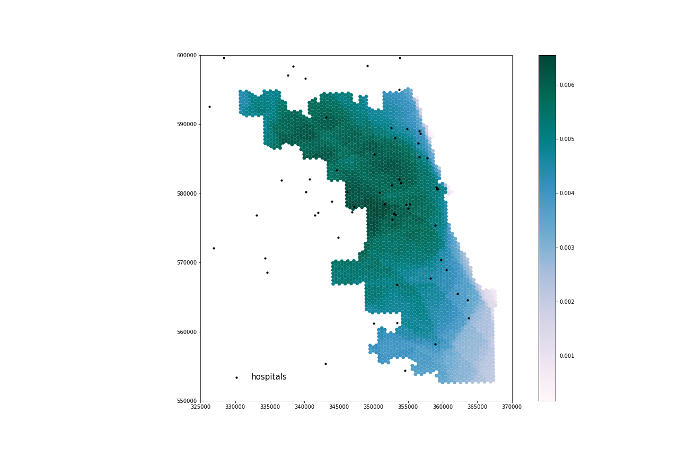
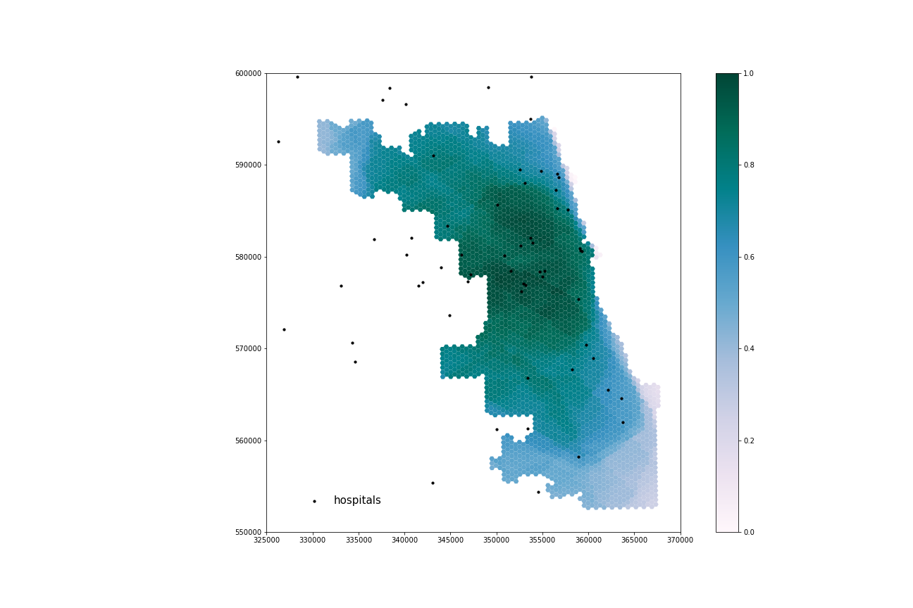

Emma Waugh, Middlebury College

Version 1.0 | Created 2021-11-2 | Last Updated 2021-12-19

The reproducible research compendium for this study is located [here](https://github.com/emwaugh/RPr-Kang-2020). The original study's repository is located [here](https://github.com/HEGSRR/RPr-Kang-2020).

### Keywords
reproducible, COVID-19, healthcare resources, spatial accessibility, Illinois

## Original Study Design

Kang et al. (2020) created a tool to measure spatial accessibility of COVID-19-related hospital resources (ICU beds and ventilators) in Illinois, as well as highlight gaps in distribution of resources during the pandemic. They utilized an enhanced two-step floating catchment area method to determine hospital service areas and their overlap. At-risk populations were defined as those over 50 years of age.

The study was completed using CyberGISX and published as a reproducible research compendium, including the original code in an accompanying Jupyter notebook.

## Introduction

The study remains relevant as the pandemic continues; it has been updated with changes in data source and format, as well as replicated for various other areas of the country. The reproducible research compendium format allows for these changes to be made, as well as reanalyses that incorporate improved methodology, differing data sources, or further interpretation of results. This study is a reanalysis focused on improving accuracy of hospital availability despite boundary effects.

Initially, the Kang et al. study of the Chicago area excluded road networks outside the city limits but included hospitals outside. That led to erroneous placement of hospitals on the boundary during the nearest node calculations, and resulted in an inaccurate representation of spatial accessibility for inter-city healthcare travel, i.e. suburban residents who may travel into the city for care, or Chicago residents who go to nearby suburban hospitals.

A reanalysis by students in spring 2021 addressed the former by adding a 15 mile buffer around the Chicago street network. This meant that network travel for city residents to suburban healthcare centers was accurately accounted for, but still overestimates the capacity for those hospitals since the population of the surrounding communities was not included.

This reanalysis addresses that gap by including census tract data from beyond the city limits to match the spatial extent of the expanded road network. Therefore, the at-risk populations within the surrounding communities are incorporated into measurements of hospital capacity. This reanalysis also includes error checks through frequent table previewing and recalculating totals.

## Methods

This study was completed using CyberGISX with a clone of the `02-COVID-19Acc-Original.ipynb` Jupyter notebook, which is a replication of the original notebook created by Kang et al. (2020). The most recent revision to that notebook was in August 2021.

In this reanalysis, census tract-level demographic information and geometries is included from the five counties adjacent to Cook County (Lake, McHenry, Kane, DuPage, and and Will County). Data sources are identified below.

### Data sources

- **Illinois census tracts geometry** can be downloaded from the United States Census Bureau's [Cartographic Boundary Shapefiles](https://www.census.gov/geographies/mapping-files/time-series/geo/carto-boundary-file.html)
  - Census Tracts → Illinois


- **Demographic data** from the United States Census Bureau can be downloaded from the [American Community Survey Advanced Search](https://data.census.gov/cedsci/table?text=b1001%20acs&t=Age%20and%20Sex&g=0400000US17%241400000&tid=ACSST5Y2019.S0101)
  - Topic → Age and Sex
  - Geography → All Census Tracts within Illinois
  - Product → 2018: ACS 5-Year Estimates Subject Tables

### Data transformation and spatial accessibility model

We read in census tract geometries for Cook and the five surrounding counties:

```py
illinois_tracts = gpd.read_file('./data/raw/public/PopDataBuffered/cb_2018_17_tract_500k.shp')
illinois_tracts = illinois_tracts.to_crs(epsg = 4326)
illinois_tracts = illinois_tracts.loc[(illinois_tracts["COUNTYFP"] == '031') |
                                      (illinois_tracts["COUNTYFP"] == '197') |
                                      (illinois_tracts["COUNTYFP"] == '043') |
                                      (illinois_tracts["COUNTYFP"] == '089') |
                                      (illinois_tracts["COUNTYFP"] == '097') |
                                      (illinois_tracts["COUNTYFP"] == '111')]
```
We also read in demographic data by census tract; the at-risk demographic group in Kang et al. is defined as people aged 50 and over. Age and sex categories are used to select and sum those groups in each census tract:
```py
demographic_data = pd.read_csv('./data/raw/public/PopDataBuffered/ACSDT5Y2018.B01001_data_with_overlays_2021-10-28T145639.csv', sep = ',', skiprows = [1,1])

at_risk_csv = demographic_data[["GEO_ID",
                                "NAME",
                                "B01001_001E",
                                "B01001_016E",
                                "B01001_017E",
                                "B01001_018E",
                                "B01001_019E",
                                "B01001_020E",
                                "B01001_021E",
                                "B01001_022E",
                                "B01001_023E",
                                "B01001_024E",
                                "B01001_025E",
                                "B01001_040E",
                                "B01001_041E",
                                "B01001_042E",
                                "B01001_043E",
                                "B01001_044E",
                                "B01001_045E",
                                "B01001_046E",
                                "B01001_047E",
                                "B01001_048E",
                                "B01001_049E"]]

at_risk_csv['OverFifty'] = at_risk_csv.iloc[:, 3:23].sum(axis = 1)
at_risk_csv['TotalPop'] = at_risk_csv['B01001_001E']

at_risk_csv = at_risk_csv.drop(at_risk_csv.columns[2:23], axis = 1)
```
Then, that information is joined to the census tract geometry and fed into Kang et al.'s analysis to calculate hospital service-to-population ratios and run the spatial accessibility model:

```py
new_names = {"GEO_ID" : "AFFGEOID"}
at_risk_csv = at_risk_csv.rename(columns = new_names)

atrisk_data = illinois_tracts.merge(at_risk_csv, how='inner', on='AFFGEOID')
atrisk_data.head()
```

## Results
The code for this reanalysis is called `04-COVID-19Acc-Reanalysis-323f21` and can be found in [the RPr-Kang-2020 GitHub repository](https://github.com/emwaugh/RPr-Kang-2020).

A comparison of the accessibility maps from the spring 2021 reproduction (with expanded road network) and this reanalysis shows a redistribution of healthcare accessibility throughout Cook County. These effects are most apparent in the high accessibility values in western and northwestern Cook County.


***Figure 1***. Spatial accessibility to healthcare resources in Cook County using ICU beds from the spring 2021 reproduction.

***Figure 2***. Spatial accessibility to healthcare resources in Cook County using ICU beds from this reanalysis.

## Discussion

Reproduction facilitated a thorough review of the Kang et al. study, illuminating assumptions, decisions, and gaps in the methodology that could impact the results. Assumptions include justifications for travel time and network travel weights, whether ICU beds and ventilators actual indicate hospital capacity, default speed limits, and personal transportation methods, among many others. The review of sources of uncertainty and error can inform future reproductions and replications, which will help to better understand and address the gaps in healthcare availability.

Kang et al. were not clear about the sources of their data. This reanalysis attempted to improve that using the `censusdata` package which also facilitates easy download. Because we were unable to use `censusdata`, I include detailed instructions for downloading demographic data tables and shapefiles from the United States Census Bureau webpage for the expanded data inputs (with surrounding county tracts).

The original study of the Chicago area was limited by the borders drawn through potential service areas. According to the reanalysis, the areas with highest accessibility to healthcare resources are in central Cook County, or closer to Chicago. These differences suggest that the original results erroneously display higher accessibility in areas near Cook County's borders because hospital use by residents of neighboring counties was not considered. Thus, the original study overestimated healthcare resource availability in those areas.

This reanalysis reveals the impact of boundary effects on the network model, and the misrepresentation of accessibility that results from them. This is important for future reproductions and replications; even when all of Illinois is included, hospitals and people nearby in surrounding states may be ignored. When replicating for other states or regions, buffers for road networks and demographic data will improve accuracy of the model.

Last, the original study included no built in error checking mechanisms. They likely used then removed them from the final published code but we feel that it is important to document tests to show that the study is comprehensively designed to include those processes.

## Conclusions

Open source science and reproducible methodology provides the opportunity to investigate and learn from decisions, assumptions, and potential error in the study. Kang et al. created a computational notebook that can efficiently and quickly analyze healthcare accessibility gaps, which is crucial during a global pandemic. Because they published code alongside their paper, the methodology is accessible to make updates and improvements as they become necessary or available.

According to this reanalysis, Cook County residents living close to Chicago have generally better access to COVID-19 resources, while the northwestern and southeastern areas of the county are underserved in comparison. When compared to the original results, this study provides a more accurate picture of resource accessibility throughout Cook County.  An accurate depiction of healthcare accessibility is needed for coordinated responses and effective resource reallocation to underserved areas in Illinois and the rest of the world.

## Reference

Kang, J. Y., A. Michels, F. Lyu, Shaohua Wang, N. Agbodo, V. L. Freeman, and Shaowen Wang. 2020. Rapidly measuring spatial accessibility of COVID-19 healthcare resources: a case study of Illinois, USA. International Journal of Health Geographics 19 (1):1–17. DOI:10.1186/s12942-020-00229-x.
