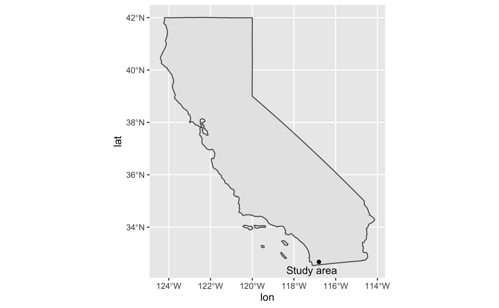

Emma Waugh, Middlebury College

Version 1.0 | Created 2021-12-15 | Last Updated 2021-12-18

## Abstract

This study replicates a vignette for an R package called MODISTools, which is designed for easily downloading MODIS timeseries directly into an R workspace. This replication seeks to analyze change in leaf area index (LAI), as an indicator of vegetation change or loss in southern California resulting from wildfires. Because MODISTools is designed for small study areas, I focus on a 20 x 20km area in San Diego County, from 2003 to 2021. I find that there is overall little change in vegetation cover throughout the time period in this area, though the small study area may not reflect broader trends in vegetation cover in southern California.

The reproducible research compendium for this study is located [here](https://github.com/emwaugh/RPl-MODISTools).

### Keywords

MODIS, MODISTools, wildfire, California, leaf area index, land cover

### Background

Leaf area index is defined as the ratio of one-sided green leaf area to unit ground area (deciduous vegetation) or half the needle surface area to unit ground area (coniferous vegetation)(EarthData). Unlike the Normalized Difference Vegetation Index (NDVI), LAI is a quantitative measurement of how much vegetation is present, so it is commonly used as an indicator for evaporation/transpiration, rainfall, water resource use, and crop health (Zheng & Moskal 2009). Monitoring LAI over the long term can show the impacts of climate change, land use change, wildfires, and more on vegetated areas.

In southern California, increasing temperatures and less predictable precipitation in recent decades, as well as increasing wildfire prevalence in the region, have contributed to changes in vegetation cover type—primarily a decrease in overall vegetation cover (Potter 2019). This study aims to quantify those changes using Moderate Resolution Imaging Spectroradiometer (MODIS) satellite imagery over a 17-year period.

## Study design

The MODISTools R package, developed by Tuck et al. (2014), is designed for importing MODIS time series data of small regions or single pixels within the MODIS Land Product Subset API at the Oak Ridge National Laboratory Distributed Active Archive Center (DAAC).

This study is based on a [MODISTools vignette](https://cran.r-project.org/web/packages/MODISTools/vignettes/modistools-vignette.html), in which a MODIS time series is downloaded to analyze seasonal patterns in leaf area index (LAI) in the Bay of Arcachon, France. I build upon the methodology demonstrated in the vignette in order to produce an analysis of the change in land cover types and LAI in southern California as a result of wildfires.

This study covers a 20 x 20 km area in San Diego County, California (centered around the coordinates 32.674, -116.8054), from 2003 to 2019 and 2003 to 2021 (Figure 1). The study area was selected based on the results of a spatial density analysis of wildfire occurrence by Li and Banerjee (2021) (Figure 2). The dates were chosen based on the availability range of MODIS products.



**Figure 1.** *The study area is a 20 x 20km square in San Diego County, Southern California, with (32.674, -116.8054) as the center coordinates.*


**Figure 2.** *[Li and Banerjee's (2021)](https://www.nature.com/articles/s41598-021-88131-9) kernel density distribution of wildfire occurrence. CAL FIRE Operational Unit MVU (San Diego Unit) had a high density of fires in 2000-2019.*

In order to quantify vegetation cover change, I plot LAI over time from 2003 to 2021, and calculate the difference in April LAI from 2003 to 2019. I chose to focus on April because peak vegetation growth in southern California occurs during that month (Figure 3).


**Figure 3.** *Leaf area index by land cover class in study area throughout 2019. Peaks appear around Julian day 100, or April 10.*


## Materials and procedure

### Data and variables

- **MCD15A2H** MODIS Leaf Area Index/FPAR 8-Day Global 500m
   - **Band:** LAI
   - Available 2003-2021


- **MCD12Q1** MODIS Land Cover Type Yearly Global 500m
   - **Band:** LC_Type1
   - Available 2003-2019
   - Land cover information is stored as 17 classifications, and is updated yearly. The categories found within this study area are closed shrubland, open shrubland, woody savanna, savanna, grasslands, permanent wetland, cropland, urban and built-up land, barren, and water body. The spatial resolution of MCD12Q1 is 500m.

I downloaded the LAI data for the overall timeseries (2003-2021) using the `mt_subset_batch` function:

```python
LAI_full = mt_batch_subset(df = ROI,
                           product = "MOD15A2H",
                           band = "Lai_500m",
                           internal = TRUE,
                           start = "2003-01-01",
                           end = "2021-12-31")
```

I downloaded the LAI and LC data for 2003 and 2019 using the `mt_subset` function:

```python
fire_lai_03 <- mt_subset(product = "MOD15A2H",
                      lat = 32.674,
                      lon =  -116.8054,
                      band = "Lai_500m",
                      start = "2003-04-01",
                      end = "2003-04-30",
                      km_lr = 20,
                      km_ab = 20,
                      site_name = "san diego",
                      internal = TRUE,
                      progress = FALSE)

fire_lc_03 <- mt_subset(product = "MCD12Q1",
                     lat = 32.674,
                     lon =  -116.8054,
                     band = "LC_Type1",
                     start = "2003-01-01",
                     end = "2003-12-31",
                     km_lr = 20,
                     km_ab = 20,
                     site_name = "san_diego",
                     internal = TRUE,
                     progress = FALSE)
```

### Data transformations

After the data was retrieved, I merged the two dataframes, then summarized the median LAI value for each land cover groups:

```python
fire_03 <- fire_lc_03 %>%
  rename("lc" = "value") %>%
  dplyr::select("lc","pixel") %>%
  right_join(fire_lai_03, by = "pixel")

fire_03 <- fire_03 %>%
  filter(value <= 100,
          lc %in% c("6", "7", "9", "10", "11", "12", "13", "16")) %>%
  mutate(lc = case_when(
      lc == 6 ~ "closedshrub",
      lc == 7 ~ "openshrub",
      lc == 9 ~ "savanna",
      lc == 10 ~ "grassland",
      lc == 11 ~ "wetland",
      lc == 12 ~ "cropland",
      lc == 13 ~ "urbanland",
      lc == 16 ~ "barren")) %>%
  group_by(lc, calendar_date) %>% # group by lc and date
  summarize(doy = as.numeric(format(as.Date(calendar_date)[1],"%j")),
            lai_mean = median(value * as.double(scale)))
```

I also converted the coordinates from sinusoidal (the MODIS default) to latitude longitude, and bind back to the original dataframe:

```python

lat_lon_03 <- sin_to_ll(fire_lc_03$xllcorner, fire_lc_03$yllcorner)

subset_03 <- cbind(fire_lc_03, lat_lon_03)
```

I created bounding boxes of the extracted data:

```python
bb_03 <- apply(fire_lc_03, 1, function(x){
  mt_bbox(xllcorner = x['xllcorner'],
          yllcorner = x['yllcorner'],
           cellsize = x['cellsize'],
           nrows = x['nrows'],
           ncols = x['ncols'])
})

```

To make the data into a raster, I used the `mt_to_raster` tool. The rasters are created in the original sinusoidal projection, which is distorted due to California's distance from the central meridian:

```python
LC_r_03 <- mt_to_raster(df = fire_lc_03, reproject = FALSE)
LAI_r_03 <- mt_to_raster(df = fire_lai_03, reproject = FALSE)
```
The above process is repeated for the year 2019.

### Analysis

I plotted the LAI timeseries using this code:

```python
ggplot(LAI_full,
       aes(x = as.POSIXct(calendar_date),
           y = value)) +
  geom_point() +
  geom_line() +
  geom_smooth() +
  ylab("LAI") +
  xlab("Date") +
  theme_classic() +
  scale_color_brewer(palette = "Dark2")
```

The difference between LAI values in 2003 and 2019 are calculated using simple raster arithmetic:

```python
lai_2019 <- abs(max(LAI_r_19[[1]], na.rm = TRUE))
lai_2003 <- abs(max(LAI_r_03[[1]], na.rm = TRUE))

diff <- lai_2019 - lai_2003
```

Positive values in the resulting `diff` raster correspond to increased vegetation cover, while negative values indicate decreased cover.

The changes in LC composition can be plotted using the following code:

```python
fire_lc_19_plot <- fire_lc_19 %>%
  mutate(year = "2019")

fire_lc_03_plot <- fire_lc_03 %>%
  mutate(year = "2003")

fire_toplot <- rbind(fire_lc_19_plot, fire_lc_03_plot)

fire_toplot <- fire_toplot %>%
  mutate(lc_name = case_when(
    value == 6 ~ "closed shrub",
    value == 7 ~ "open shrub",
    value == 8 ~ "woody savanna",
    value == 9 ~ "savanna",
    value == 10 ~ "grassland",
    value == 11 ~ "wetland",
    value == 12 ~ "cropland",
    value == 13 ~ "urban land",
    value == 16 ~ "barren")) %>%
  group_by(lc_name, year) %>%
  summarise(num = n())

fire_toplot %>%
  ggplot(aes(x = num, y = year, fill = lc_name)) +
  geom_bar(stat = "identity")
```

Additionally, I viewed changes in specific LC pixel values with this code:

```python
lc_combined <- fire_lc_19 %>%
  rename("lc19" = "value") %>%
  dplyr::select("lc19","pixel") %>%
  right_join(fire_lc_03, by = "pixel") %>%
  rename("lc03"= "value")

lc_combined %>%
  dplyr::select(lc19, lc03) %>%
  filter(lc19 != lc03)
```

## Results

In the study area, LAI increased in much of the area between 2003 and 2019 (Figure 4).


**Figure 4.** *Difference in April LAI in the study area between 2003 and 2019. Dark green corresponds to an increased in vegetation, light green to no change, and orange/white to a decreased in vegetation cover.*

Over time yearlyLAI remains relatively constant in the study area, with the exception of high values seen in early 2010 (Figure 5). Seasonal patterns are visible in this plot; vegetation increases sharply in early spring, then decreases steadily throughout the summer and autumn.


**Figure 5.** *Timeseries of LAI in the study area from 2003 to 2021.*

Land cover class composition changed slightly from 2003 to 2019 as well; savanna cover increased slightly while closed shrub and grassland cover decreased, and open shrub and urban cover remained about the same (Figure 6).


**Figure 6.** *Plot of land cover composition in 2019 and 2003.*

## Discussion

In general, LAI is mostly unchanged in the small study area since 2003. Land cover composition in the area is also primarily unchanged, with slight changes in closed shrub and savanna cover types.

The study area may be too small a region to necessarily reflect any broader trends in vegetation cover change or loss, a limitation discussed below. A Forest Service study of land cover change in southern California from 1995-2002 found that in a 17.3 million-acre study area, vegetation cover type changed over 1.4% of the area, vegetation cover decreased over 1.1% of the area, and vegetation increased over 0.25% of the area (Fischer et al. 2007). These percentages correspond to totals of hundreds of thousands of acres of change, but illustrate the range in response, as well as the majority of areas with no change. This study's focus area is likely within such an area, perhaps due to buffers from elevation, regional microclimate, resilient vegetation types, or otherwise.

### Limitations

The MODISTools package is designed for downloading data in a small study area or even a single pixel. It can also be used to easily compare multiple sites (John 2019). However, downloading MODIS data as dataframes is inefficient for larger regions or longer timescales, which limits the scaleability of this process. The small area selected for this study may not reflect overall regional-scale trends in changing vegetation cover as a result of decreased precipitation or increased wildfires. Future iterations of this study could take advantage of the MODISTools `mt_batch_subset` tool to compare multiple areas with differing precipitation patterns, elevation, vegetation type, or wildfire occurence.

Additionally, the MODIS data is stored a sinusoidal projection, which distorts rasters at California's longitude. It still allows for comparison of individual pixels but makes for somewhat inaccurate spatial representation of values (as seen in Figure 4).

## Conclusions

MODISTools is an excellent tool for observing change over time in small areas or as preliminary research for choosing a study site. It can also be used to quickly visualize timeseries, as well as plot differences between sites. This study showed that vegetation cover on small scales may not reflect broader trends, though this information may still be valuable for local management.

## References

Fischer, L., Ramirez, C., Maurizi, B., & Haunreiter, E. (2007). Monitoring Land Cover Changes in California: South Coast Project Area, Cycle II (California Land Cover Mapping and Monitoring Program). United States Forest Service. [fs.usda.gov/Internet/FSE_DOCUMENTS/fsbdev3_046217.pdf](https://www.fs.usda.gov/Internet/FSE_DOCUMENTS/fsbdev3_046217.pdf).


Hufkens, K. (2020, March 4). MODISTools. The Comprehensive R Archive Network. [cran.r-project.org/web/packages/MODISTools/vignettes/modistools-vignette.html](https://cran.r-project.org/web/packages/MODISTools/vignettes/modistools-vignette.html)

John, C. (2019, January 24). Import, process, and plot NDVI time series data using MODISTools. Christian John (M.Sc.), Ecologist. [jepsonnomad.github.io/tutorials/MODISTools_Intro.html](https://jepsonnomad.github.io/tutorials/MODISTools_Intro.html)

Leaf-Area Index & Fraction of Absorbed Photosynthetically Active Radiation—LAADS DAAC. (n.d.). EarthData. Retrieved December 10, 2021, from [ladsweb.modaps.eosdis.nasa.gov/missions-and-measurements/science-domain/lai-and-fpar/](https://ladsweb.modaps.eosdis.nasa.gov/missions-and-measurements/science-domain/lai-and-fpar/)

Li, S., & Banerjee, T. (2021). Spatial and temporal pattern of wildfires in California from 2000 to 2019. Scientific Reports, 11(1), 8779. DOI: [10.1038/s41598-021-88131-9](10.1038/s41598-021-88131-9)

Tuck, S. L., Phillips, H. R. P., Hintzen, R. E., Scharlemann, J. P. W., Purvis, A., & Hudson, L. N. (2014). MODISTools – downloading and processing MODIS remotely sensed data in R. Ecology and Evolution, 4(24), 4658–4668. DOI: [10.1002/ece3.1273](10.1002/ece3.1273)

Zheng, G., & Moskal, L. M. (2009). Retrieving Leaf Area Index (LAI) Using Remote Sensing: Theories, Methods and Sensors. Sensors (Basel, Switzerland), 9(4), 2719–2745. DOI: [10.3390/s90402719](10.3390/s90402719)
