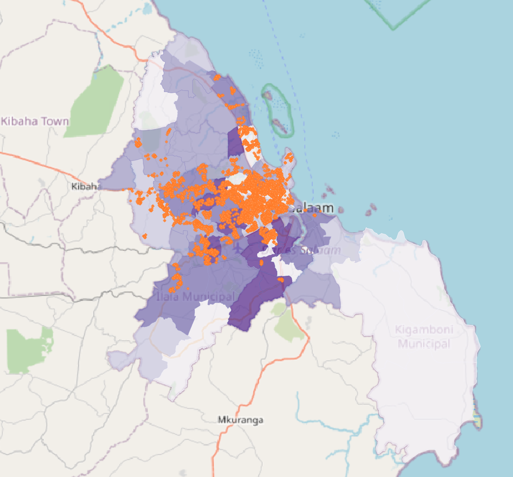

#### October 2021



## Question/Abstract?
This study uses densities of impervious surfaces and poorly managed solid waste sites throughout the wards of Dar es Salaam, Tanzania, to obtain information on pollution pathways during flood events.``` (more here)```

### Keywords
Dar es Salaam, impervious surfaces, waste, flood resilience

## Methods
This study is an analysis of impervious surface cover and waste site management across 95 wards in Dar es Salaam, Tanzania, to determine wards with higher risk of surface water contamination during flood events. All analysis is on the ward scale, with impervious surface cover and waste sites aggregated by ward location.

### Data sources
- [OpenStreetMap](https://www.openstreetmap.org/#map=12/-6.8162/39.2203) is a global collaborative geographic database
    - ```planet_osm_roads``` and ```planet_osm_polygons``` layers for impervious surface cover throughout Dar es Salaam (as of October 2021)
- [ResilienceAcademy](https://resilienceacademy.ac.tz/data/) is a project that uses digital tools and open source data to address climate-related risks and vulnerabilities in urban areas. The [Climate Risk Database](https://geonode.resilienceacademy.ac.tz/) is a geospatial data repository for disaster research and management.
    - ```Dar es Salaam Waste Sites``` points with poorly managed solid waste sites, mapped as part of the [Let's Do It World](https://letsdoitworld.org) cleanup project

### Data limitations
```
Impervious surfaces are open source data mapped by thousands of contributors, and therefore cannot be considered exhaustive.
impervious surfaces are not consistent throughout wards. A visual comparison with satellite imagery suggests that most primary roads are not included in planet_osm_roads.

Additionally, the majority of OSM data points were created in ___, suggesting ___.
```
### Data preparation
First, I defined impervious surfaces as areas where water can't infiltrate the ground. In the context of Dar es Salaam's OpenStreetMap data, that meant having a paved or asphalt surface, or being a building. I identified all impervious roads (polylines) and polygons in the database.

```sql
CREATE TABLE impervroads
AS
SELECT osm_id, way
FROM planet_osm_roads
WHERE surface = 'paved' OR surface = 'asphalt';

CREATE TABLE impervpoly
AS
SELECT osm_id
FROM planet_osm_polygon
WHERE surface = 'paved' OR surface = 'asphalt' OR building = 'yes';
```
In order to combine the two above queries into one with all impervious surfaces, I first buffered the road polylines to make them into polygons. I determined that 5m was a reasonable buffer based on a visual inspection of roads via satellite imagery.

I also reprojected both layers and the wards layer into the EPSG:32737 coordinate reference system and typecast them as multipolygons.

```sql
CREATE TABLE impervsurf
AS
SELECT osm_id, st_buffer(st_transform(way, 32737), 5)::geometry(multipolygon, 32737) AS geom FROM impervroads
UNION
SELECT osm_id, st_transform(way, 32737)::geometry(multipolygon,32737) AS geom FROM impervpoly;

CREATE TABLE wards_repro
AS
SELECT wards.id, wards.ward_name, wards.totalpop, st_transform(geom, 32737)::geometry(multipolygon, 32737) AS geom FROM wards;
```
I intersected the impervious surface layer with the wards layer in order to assign ward information to each impervious feature. I aggregated the impervious surfaces by ward, creating a multipart feature with all impervious surfaces for each ward.

```sql
CREATE TABLE impervsurf_withward
AS
SELECT impervsurf.osm_id, st_multi(st_intersection(impervsurf.geom, wards_repro.geom))::geometry(multipolygon, 32737) AS geom, wards_repro.ward_name
FROM impervsurf2 INNER JOIN wards_repro
ON st_intersects(impervsurf.geom, wards_repro.geom);

CREATE TABLE impervsurf_byward
AS
SELECT ward_name, st_union(impervsurf_withward.geom)::geometry(multipolygon, 32737) AS geom
FROM impervsurf_withward
GROUP BY ward_name;
```

### Data analysis
I calculated
```sql
/* calculate total area of impervious surfaces by ward */
ALTER TABLE impervsurf_byward
ADD COLUMN impervarea int;

UPDATE impervsurf_byward
SET impervarea = st_area(geom);

/* join impervious surface data back to original ward geometry */
ALTER TABLE wards_repro
ADD COLUMN impervarea int;

UPDATE wards_repro
SET impervarea = impervsurf_byward.impervarea
FROM impervsurf_byward
WHERE impervsurf_byward.ward_name = wards_repro.ward_name;

/* calculate proportion of impervious surface area by ward */
ALTER TABLE wards_repro
ADD COLUMN propimperv real;

UPDATE wards_repro
SET propimperv = impervarea / st_area(geom)::real;

/* PART (2) waste site density */
/* select all waste sites, including name and info about cleanup method */
CREATE TABLE waste_repro
AS
SELECT waste.waste_site, waste.clean_up_m, st_transform(waste.geom, 32737)::geometry(point, 32737) AS geom FROM waste;

/* join waste sites data to wards geometry */
CREATE TABLE waste_withward
AS
SELECT wards_repro.ward_name, waste_repro.waste_site, waste_repro.clean_up_m, st_multi(waste_repro.geom)::geometry(multipoint, 32737) AS geom, wards_repro
FROM waste_repro INNER JOIN wards_repro
ON st_intersects(waste_repro.geom, wards_repro.geom);

/* aggregate geometries by wards, counting waste sites. st_multi() used to make geometry type match column type, which is multipoint in this case */
CREATE TABLE waste_byward
AS
SELECT ward_name, st_multi(st_union(waste_withward.geom))::geometry(multipoint, 32737) AS geom, count(ward_name)
FROM waste_withward
GROUP BY ward_name;

/* join waste site info back to original ward geometry */
ALTER TABLE wards_repro
ADD COLUMN wastecount int;

UPDATE wards_repro
SET wastecount = waste_byward.count
FROM waste_byward
WHERE waste_byward.ward_name = wards_repro.ward_name;

/* calculate waste site density by ward */
ALTER TABLE wards_repro
ADD COLUMN waste_density real;

UPDATE wards_repro
SET waste_density = wastecount / st_area(geom)::real;
```
### Analysis

## Results
Click [here](assets/): to view the interactive map.


## Discussion

## Conclusion
