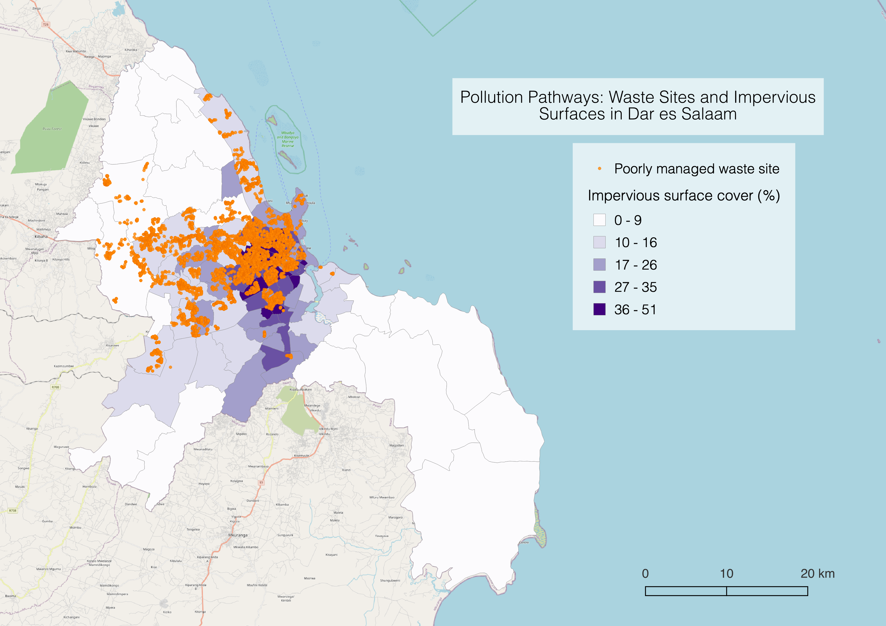

October 2021



## Background
The presence of impervious ground materials means lower infiltration rates and increased quantities of runoff during storm events. This results in the transport of pollutants in surface water, which may ultimately end up in aquatic ecosystems and drinking water sources.

This study aims to characterize the risk for pollution transport during rain events via measurement of impervious surface cover and poorly managed solid waste sites throughout the wards of Dar es Salaam, Tanzania.

### Keywords
Dar es Salaam, impervious surfaces, waste, flood resilience

## Methods
This study is an analysis of impervious surface cover and waste site management across 95 wards in Dar es Salaam, Tanzania, to determine wards with higher risk of surface water contamination during flood events. All analysis is on the ward scale, with impervious surface cover and waste sites aggregated by ward location.

### Data sources
- [OpenStreetMap](https://www.openstreetmap.org/#map=12/-6.8162/39.2203) is a global collaborative geographic database
    - `planet_osm_roads` and `planet_osm_polygon` layers for impervious surface cover throughout Dar es Salaam (as of October 2021)
- [ResilienceAcademy](https://resilienceacademy.ac.tz/data/) is a project that uses digital tools and open source data to address climate-related risks and vulnerabilities in urban areas. The [Climate Risk Database](https://geonode.resilienceacademy.ac.tz/) is a geospatial data repository for disaster research and management.
    - `Dar es Salaam Waste Sites` points with poorly managed solid waste sites, mapped as part of the [Let's Do It World](https://letsdoitworld.org) cleanup project

### Data preparation
First, I defined impervious surfaces as areas where water can't infiltrate the ground. In the context of Dar es Salaam's OpenStreetMap data, that meant having a paved or asphalt surface, or being a building. I identified all impervious roads (polylines) and polygons in the database.

```sql
CREATE TABLE impervroads
AS
SELECT osm_id, way
FROM planet_osm_roads
WHERE surface = 'paved' OR surface = 'asphalt';

CREATE TABLE impervpoly
AS
SELECT osm_id
FROM planet_osm_polygon
WHERE surface = 'paved' OR surface = 'asphalt' OR building = 'yes';
```
In order to combine the two above queries into one with all impervious surfaces, I first buffered the road polylines to make them into polygons. I determined that 5m was a reasonable buffer based on a visual inspection of roads via satellite imagery.

I also reprojected both layers and the wards layer into the EPSG:32737 coordinate reference system and typecast them as multipolygons.

```sql
CREATE TABLE impervsurf
AS
SELECT osm_id, st_buffer(st_transform(way, 32737), 5)::geometry(multipolygon, 32737) AS geom FROM impervroads
UNION
SELECT osm_id, st_transform(way, 32737)::geometry(multipolygon,32737) AS geom FROM impervpoly;

CREATE TABLE wards_repro
AS
SELECT wards.id, wards.ward_name, wards.totalpop, st_transform(geom, 32737)::geometry(multipolygon, 32737) AS geom FROM wards;
```
I intersected the impervious surface layer with the wards layer in order to assign ward information to each impervious feature. I aggregated the impervious surfaces by ward, creating a multipart feature with all impervious surfaces for each ward.

```sql
CREATE TABLE impervsurf_withward
AS
SELECT impervsurf.osm_id, st_multi(st_intersection(impervsurf.geom, wards_repro.geom))::geometry(multipolygon, 32737) AS geom, wards_repro.ward_name
FROM impervsurf2 INNER JOIN wards_repro
ON st_intersects(impervsurf.geom, wards_repro.geom);

CREATE TABLE impervsurf_byward
AS
SELECT ward_name, st_union(impervsurf_withward.geom)::geometry(multipolygon, 32737) AS geom
FROM impervsurf_withward
GROUP BY ward_name;
```
I then selected all waste sites from the ResilienceAcademy's ```Dar es Salaam Waste Sites``` layer, and reprojected them to match the ward geometry. Then, I intersected them with the ward layer to assign ward information to each waste site point. Then I grouped the waste sites by ward, counting the total for each ward.

```sql
CREATE TABLE waste_repro
AS
SELECT waste.waste_site, waste.clean_up_m, st_transform(waste.geom, 32737)::geometry(point, 32737) AS geom FROM waste;

CREATE TABLE waste_withward
AS
SELECT wards_repro.ward_name, waste_repro.waste_site, waste_repro.clean_up_m, st_multi(waste_repro.geom)::geometry(multipoint, 32737) AS geom, wards_repro
FROM waste_repro INNER JOIN wards_repro
ON st_intersects(waste_repro.geom, wards_repro.geom);

CREATE TABLE waste_byward
AS
SELECT ward_name, st_multi(st_union(waste_withward.geom))::geometry(multipoint, 32737) AS geom, count(ward_name)
FROM waste_withward
GROUP BY ward_name;
```
### Data analysis
To determine wards' proportion of impervious surfaces and waste site densities, I joined those totals to the original ward geometry to compare them to each wards' area.

First, I calculated total area of impervious surfaces by ward, and joined that information back to the original ward geometry to determine the proportion of impervious surface in each ward.

```sql
ALTER TABLE impervsurf_byward
ADD COLUMN impervarea int;

UPDATE impervsurf_byward
SET impervarea = st_area(geom);

ALTER TABLE wards_repro
ADD COLUMN impervarea int;

UPDATE wards_repro
SET impervarea = impervsurf_byward.impervarea
FROM impervsurf_byward
WHERE impervsurf_byward.ward_name = wards_repro.ward_name;

ALTER TABLE wards_repro
ADD COLUMN propimperv real;

UPDATE wards_repro
SET propimperv = impervarea / st_area(geom)::real;
```
Then, I joined the waste site counts back to the original ward geometry and calculated the density of waste sites by ward area.

```sql
ALTER TABLE wards_repro
ADD COLUMN wastecount int;

UPDATE wards_repro
SET wastecount = waste_byward.count
FROM waste_byward
WHERE waste_byward.ward_name = wards_repro.ward_name;

ALTER TABLE wards_repro
ADD COLUMN waste_density real;

UPDATE wards_repro
SET waste_density = wastecount / st_area(geom)::real;
```

## Results
Click [here](assets/) to view the interactive web map of my results.

While this study produced information on waste site density and impervious surfaces that could inform ward-level waste management and flood resilience practices in Dar es Salaam, it also revealed the limitations in using OSM data for such an analysis.

The table below contains wards and accompanying waste site densities and impervious surface cover for the 61 wards that contained waste site data (of 95 total). Wards are listed in order of high to low waste density. Within those, impervious surface cover ranges widely from 2-36%. Therefore, this information is best interpreted on an individual ward level.

Ward | Waste sites per sqkm	|Impervious surface cover (% area)
Magomeni |	180.3 |	5
Manzese | 170.9	| 4
Hananasifu | 156.2 | 4
Tandale	| 152.8	|4
Mchikichini | 147.3	| 7
Jangwani|	138.8	|13
Buguruni|	129.7|	5
Mburahati|	114.1	|2
Makurumla|	103.5	|5
Makumbusho|	103.1	|6
Tabata|	102.7|	5
Kigogo|	100.3	|6
Sinza|	92.9|	7
Mzimuni	|87.0|	6
Sandali	|85.9|	23
Mwananyamala|	81.9|	6
Mabibo|	63.5	|5
Vingunguti|	61.1|	5
Ukonga	|53.5	|17
Makuburi|	46.7|	13
Kariakoo|	43.5|	11
Kinondoni	|41.6|	8
Liwiti|	32.2|	28
Ilala	|29.7	|8
Kimanga|	29.3|	29
Temeke|	29.1|	6
Kijitonyama	|28.6	|11
Kawe	|27.5|	5
Upanga Mashariki	|23.6	|6
Kimara	|23.5	|17
Ubungo	|22.6	|3
Msasani|	21.3	|6
Saranga	|18.5|	14
Msigani	|18.2	|12
Upanga Magharibi|	17.4|	3
Kinyerezi|	16.6	|10
Gongolamboto|	15.1|	11
Bonyokwa|	11.6|	9
Pugu	|11.3	|11
Segerea	|11.2|	20
Kipawa	|10.9|	12
Ndugumbi|	10.7|	5
Tandika	|10.0|	1
Buza	|9.0	|19
Makongo	|7.8	|7
Mikocheni|	7.4	|9
Kisukuru	|6.6	|16
Kwembe	|5.0	|5
Mnyamani|	4.9	|6
Mbezi	|4.4	|8
Kunduchi|	3.8	|11
Kigamboni	|2.9	|13
Charambe|	2.7	|28
Kilakala|	1.3|	36
Pugu Station|	1.1	|9
Kiwalani|	0.9	|34
Mianzini|	0.7	|26
Kivukoni|	0.4|	8
Goba|	0.1	|7
Wazo|	<0.1	|9
Majohe|	<0.1	|10

Most wards with high waste site density (50-180 sites/sqkm) had relatively low impervious surface cover, while the lower range (0-50 sites/sqkm) have generally higher impervious surface cover. As the wards closer to Dar es Salaam's center tend to have more waste sites, it is unexpected that they would have fewer roads and buildings.

The map below shows waste sites in orange, and indicates impervious surface cover by shade of purple. The waste sites appear to be concentrated in a few wards northwest from the center of the city.


It appears that the OpenStreetMap data is incomplete in the central wards, and this limitation is discussed below.

### Data limitations

Impervious surfaces are open source data mapped by thousands of contributors, and therefore cannot be considered exhaustive. In this study, it appears that impervious surfaces are not consistent throughout wards. A visual comparison with satellite imagery of Dar es Salaam suggests that most primary roads are not included in `planet_osm_roads`, and that the wards near the center of Dar es Salaam are less intensively mapped. (It does appear that the majority of OpenStreetMap listings for both `planet_osm_roads` and `planet_osm_polygon` were created or edited in the last 3 and 6 years, respectively, meaning they are likely not outdated. However, there are relatively few features in `planet_osm_roads` (1,700) compared to `planet_osm_polygon` (1.3 million) and `planet_osm_lines` (134,000). It may have been more effective to filter line features for roads instead of using the seemingly less-created roads layer.)

Finally, the road buffer of 5m (total 10m width) was based on a visual inspection of roads in satellite imagery, and is a reasonable width for primary roads. However, those primary roads are not differentiated from secondary roads and may therefore overestimate road surfaces. Since overall impervious surface appears to be underestimated in this context, I don't think road buffers impacted the results of this analysis.
