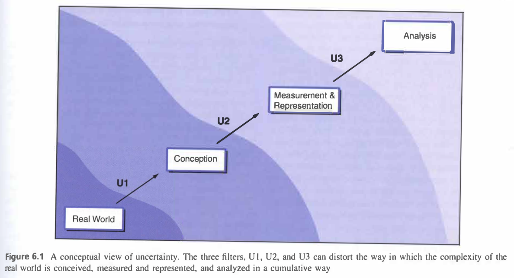

October 4, 2021

In my GIS coursework and work experiences, I don't think I've learned much about uncertainty or how best to represent it in geography.
When using geographic data, so many choices are made by researchers about how to structure their questions, where to obtain data, how to measure and
analyze data, and how to present their results, and all of these have a great impact on how uncertainty propagates throughout the work, and therefore
throughout spheres of knowledge. In class we've talked about positionality, where different life experiences and social positions shape perceptions and reality, even in "objective" sciences. To me that seems like an important part of uncertainties in conception of geographic phenomena: where even the base understandings of
truths and place and politics can play a role in the questions that are asked, or not asked. Researchers should ask those questions! In the next step, measurement and representation, data management, spatial, or statistical decisions can all perpetuate inaccuracies. I think that especially when producing visual representation
of data, it's important to be clear about the limitations of such representations, whether that's through simplification or fuzzy classification or
abstraction. It can be easy to misrepresent data or even mislead viewers through the unintentional (or intentional) choices made in cartography.

Accuracy will never be completely achieved, so representing those gaps is important. Geographers have a great responsibility to be responsible and
thoughtful producers of knowledge, and to represent the inherent inaccuracies in their work. They must be transparent in their reporting of error,
any and all decisions to manage or reduce or represent data. I think that in the literature, descriptions and justifications for those steps
would be a good way to relay those concerns and gaps to readers. In the spirit of open source, representing uncertainty and error throughout the
research process is good practice anyway, and may push researchers to be accountable for misrepresentation of their work.

*Image from Longley, et al. (2008).*

# Source:

Longley, P. A., M. F. Goodchild, D. J. Maguire, and D. W. Rhind. 2008. Geographical information systems and science 2nd ed. Chichester: Wiley. (only chapter 6: Uncertainty, pages 127-153)
